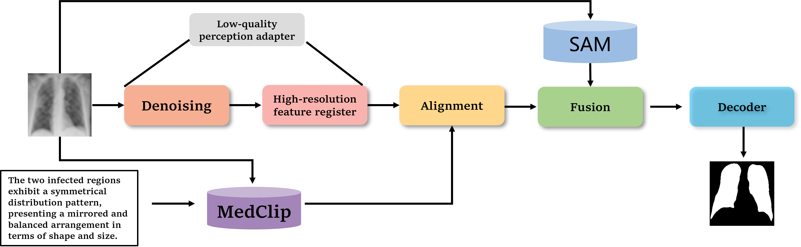

## Introduction

With the increase in large models, segmentation foundation models have greatly improved the segmentation results of medical images. However, these foundation models often yield unsatisfactory segmentation results because their training data rarely involve low-quality images. In medical imaging, issues such as considerable noise or poor image resolution are common due to imaging equipment. Using these segmentation foundation models on such images produces poor results. To address this challenge, we utilize a low-quality perception adapter to improve the capabilities of segmentation foundation models, specifically in terms of handling low-quality medical images. First, the low-quality perception adapter distills the intrinsic statistical features from images compromised by noise or reduced clarity. These intrinsic features are aligned with textual-level attributes by employing contrastive learning. Then, we use a text-vision progressive fusion strategy, starting with multilevel text-image fusion to incorporate multimodal information. Next, we incorporate visual features from the underlying segmentation foundation model. Finally, a carefully designed decoder predicts the segmented mask. The low-quality perception adapter reduces the impacts of blur and noise on the developed model, while text-based contrastive learning, along with multimodal fusion, bridge the semantic gap. Experiments demonstrate that the proposed model significantly improves segmentation accuracy on noisy or blurry medical images, with gains up to 24.6$\%$ in mIoU and 13.6$\%$ in pixel accuracy over state-of-the-art methods across multiple datasets.
<p align="center">
  
</p>

### Using the code:

- Clone this repository:
```bash
git clone https://github.com/
cd c
```

The code is stable using Python 3.8.16, Pytorch 1.7.0

To install all the dependencies using conda:

```bash
conda env create -f environment.yml
conda activate samadapter
```

To install all the dependencies using pip:

```bash
pip install -r requirements.txt
```

### Links for downloading the public Datasets:

1) MoNuSeG Dataset - <a href="https://monuseg.grand-challenge.org/Data/"> Link (Original)</a> 
2) GLAS Dataset - <a href="https://warwick.ac.uk/fac/sci/dcs/research/tia/glascontest/"> Link (Original) </a> 
3) Covid19 Dataset -<a href="https://www.sciencedirect.com/science/article/pii/S001048252100113X"> Link (Original) </a>
4) MSD Dataset -<a href="https://www.nature.com/articles/s41467-022-30695-9"> Link (Original) </a>


## Using the Code for your dataset

### Dataset Preparation

Prepare the dataset in the following format for easy use of the code. The train and test folders should contain two subfolders each: img and label. Make sure the images their corresponding segmentation masks are placed under these folders and have the same name for easy correspondance. Please change the data loaders to your need if you prefer not preparing the dataset in this format.


```bash
Train Folder-----
      img----
          0001.png
          0002.png
          .......
      labelcol---
          0001.png
          0002.png
          .......
Validation Folder-----
      img----
          0001.png
          0002.png
          .......
      labelcol---
          0001.png
          0002.png
          .......
Test_Folder Folder-----
      img----
          0001.png
          0002.png
          .......
      labelcol---
          0001.png
          0002.png
          .......

```

- The ground truth images should have pixels corresponding to the labels. Example: In case of binary segmentation, the pixels in the GT should be 0 or 255.

### Training Command:

```bash 
python train.py --train_dataset "enter train directory" --val_dataset "enter validation directory" --direc 'path for results to be saved' --batch_size 4 --epoch 400 --save_freq 10 --learning_rate 0.001
```

### Testing Command:

```bash 
python test.py --loaddirec "./saved_model_path/model_name.pth" --val_dataset "test dataset directory" --direc 'path for results to be saved' --batch_size 1 
```

The results including predicted segmentations maps will be placed in the results folder along with the model weights. Run the performance metrics code in MATLAB for calculating F1 Score and mIoU. 


